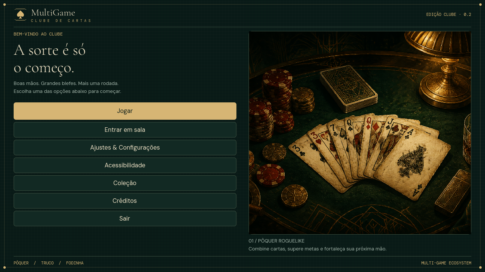

# MultiGame — Clube de cartas

Pôquer roguelike, truco e Fodinha em Godot .NET/C#, com mesas em **2.5D**, elenco articulado feito no Blender e uma identidade de clube brasileiro: feltro verde, papel creme e detalhes de latão. O acervo pixel art original foi preservado.



## O que está jogável

- **Pôquer roguelike solo:** seleção de cartas, prévia de pontuação, descartes, metas por rodada, relíquias, loja e tutorial. A apresentação dos rivais usa o novo elenco.
- **Truco solo:** 1×1, 2×2 e 3×3 com os demais lugares controlados por IA. Cada participante joga sua própria mão; o resultado do tombo considera a melhor carta de cada equipe.
- **Pena nas equipes:** o aliado que recebe a carta decide se fica com ela. A IA resolve sua própria decisão no solo; o jogador local recebe os botões quando é o destinatário.
- **Apresentação:** mesa e personagens 3D em câmera ortográfica 2.5D, leques de cartas ocultas e animações de embaralhar, cortar, entregar a pena, distribuir, jogar e recolher no truco. O pôquer anima distribuição, seleção e pontuação.
- **Elenco Blender:** seis jogáveis (Nina, Bento, Seu Corvo, Dona Onça, Iara e Zeca) e dois bosses exclusivos (Barão da Meia-Noite e Dama de Copas). Fontes `.blend`, exports GLB e cinco animações por modelo incluídos. Três vitórias com um personagem desbloqueiam seu floreio de truco.
- **Refinamento MCP:** oito personagens com mais geometria e acabamento, preservando sua identidade; gestos próprios de Corvo, Onça, Barão e Dama, relógio de salão animado, poses de repouso corrigidas e opções de iluminação aplicadas à mesa. Histórico e reprodução no **Patch 8** do [registro cumulativo](AI_DEV_PATCH_NOTES.md).
- **Pilhas e entradas:** cartas jogadas se acumulam sobre a mesa 3D; cutscenes apresentam os participantes e os bosses, com opção de pular. No truco, os resultados indicam a equipe vencedora.
- **Áudio:** cinco loops originais sintetizados, efeitos de cartas e vinhetas de entrada; volumes de música/efeitos e seleção de faixa.
- **Fodinha:** solo com três IAs, palpites antes das jogadas, cinco vidas e perda da diferença entre palpite e vitórias; nove mãos de 1→5→1 cartas, eliminação e resultado final. Regras completas no botão “Como jogar”.
- **Vídeo:** mesa renderizada nos pixels reais de sua área na janela, inclusive 4K, com interface no tamanho original; escala 3D configurável, filtragem linear e sombras ajustadas. Mais detalhes nos rostos, molduras e poltronas via Blender MCP (Patch 9). Os efeitos gráficos continuam sendo rasterização, sem ray tracing por hardware.
- **Ajustes:** perfil, áudio, opções visuais e acessibilidade, incluindo redução de movimento e modos de cor.

## Limites atuais

**O multiplayer de partida ainda precisa de implementação.** A estrutura anterior de rede/lobby LAN foi preservada, mas não sincroniza turnos, baralho nem decisões entre computadores. Portanto, a decisão de pena pelo aliado humano remoto é uma entrega futura, detalhada no plano. Não considere o botão LAN uma partida multiplayer completa.

**Fodinha está disponível em solo com IAs.** Rede, variantes regionais e progressão roguelike desse modo ficam para próximas etapas. A progressão roguelike completa do truco, habilidades exclusivas dos personagens e novos bosses mecânicos também estão no plano.

## Executar

Versões verificadas nesta revisão: **Godot 4.7.2 .NET** e **SDK .NET 8.0.424**. O SDK do projeto usa `Godot.NET.Sdk/4.7.2` e `net8.0`.

1. Instale o Godot **.NET** e o SDK .NET 8.
2. Importe `project.godot` no editor, compile C# e pressione **F5**.

No PowerShell, também é possível usar o launcher:

```powershell
$env:DOTNET_ROOT = 'C:\caminho\para\dotnet'
$env:GODOT_BIN = 'C:\caminho\para\Godot_v4.7.2-stable_mono_win64_console.exe'
.\tools\play.ps1
```

O launcher também encontra o ambiente temporário preparado neste PC enquanto ele existir em `%TEMP%\multigame-tools`. Para uso permanente, configure os caminhos acima. O `Game Hub.exe` local foi atualizado como **build de revisão/debug**; mantenha `Game Hub.pck` e a pasta `data_GameHub_windows_x86_64` ao lado dele. Essa pasta de runtime é gerada pelo export e não é versionada: em outro computador, compile/exporte o fonte ou transfira os três juntos. Os templates release instalados estão incompletos; este build não é um pacote final de distribuição.

O identificador interno `Game Hub` foi mantido para preservar o caminho dos ajustes existentes. O título visível foi atualizado para MultiGame.

## Verificação

Com as mesmas variáveis de ambiente configuradas:

```powershell
.\tools\visual_smoke.ps1
```

O script compila C#, importa recursos, verifica duplas/trios e captura o renderizador real em uma janela fora da tela. Os saves de teste ficam em um `APPDATA` temporário isolado. Imagens em `docs/screenshots`; relatório JSON e logs no diretório temporário informado ao final. O teste falha em exceções de runtime, ações esperadas ausentes ou elementos de interface fora dos limites.

## Organização e próximos passos

| Caminho | Responsabilidade |
| --- | --- |
| `core/visuals` | Tema, cartas, personagens e mesa 2.5D compartilhados |
| `core/systems` | Preferências, áudio e persistência existente |
| `core/networking` | Estrutura de lobby/rede a completar |
| `hub` | Abertura, coleção, ajustes e lobby |
| `games/poker_roguelike` | Corrida de pôquer, pontuação e loja |
| `games/truco` | Regras, turnos por lugar e apresentação do truco |
| `games/fodinha` | Palpites, vazas, vidas, IAs e apresentação de quatro participantes |
| `assets` | Acervo preservado e novos recursos visuais/sonoros |
| `tools` | Launcher, geração de áudio e verificações |

- **[Guia para IAs e Patch Notes Cumulativo](AI_DEV_PATCH_NOTES.md)** — Documentação técnica completa de arquitetura, todos os patches implementados, automação no Blender 5.2, comandos de build e regras de manutenção.
- [Entrega atual: Blender, pilhas, cutscenes, gráficos e próximas etapas](docs/plano-mesas-blender.md).
- [Primeira repaginada: implementado, pendências, critérios e perguntas](docs/plano-repaginacao-clube.md).
- [Origem das artes, prompts, áudio e licenças de fontes](assets/art-provenance.md).
- [Plano anterior de personagens/cartas/truco](docs/plano-implementacao-personagens-cartas-truco.md), mantido como histórico.

O estado anterior foi preservado na branch **Backup** antes das alterações. Esta repaginada é entregue em **review**, mantendo **main** como estava.
