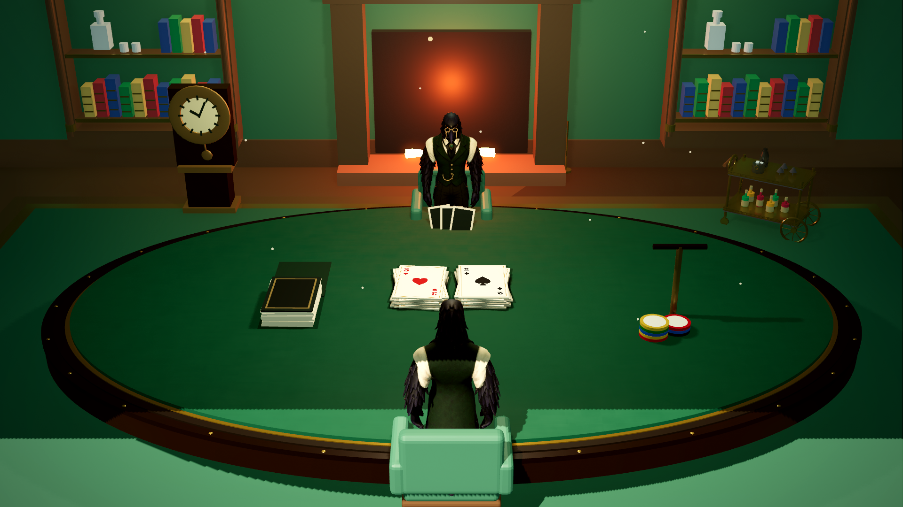
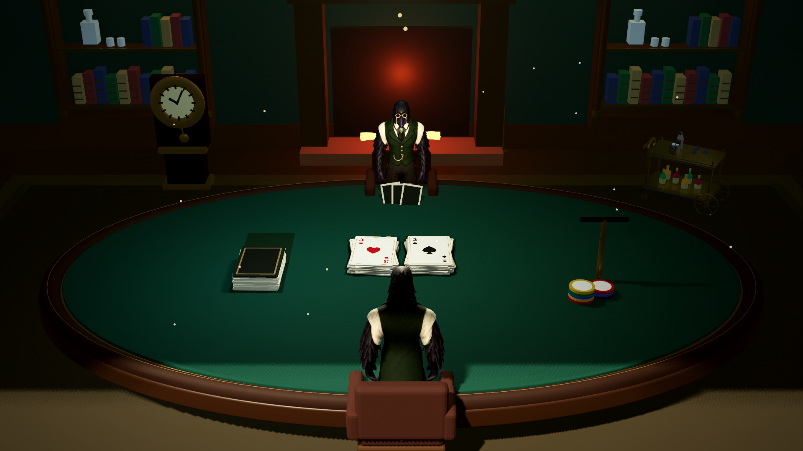

# Comparação medida — Classic Club

RTX 3050; Godot 4.7.2 .NET; Forward+/Vulkan. Menor tempo é melhor. Mediana/P95 em milissegundos; memória é estimativa do renderer.

| Configuração | Antes mediana / P95 | Depois mediana / P95 | Variação mediana | Desenhos antes → depois | Memória MiB antes → depois |
|---|---:|---:|---:|---:|---:|
| 1920-baixo-pov | 5.402 / 5.929 | 4.167 / 4.276 | -22.9% | 831 → 471 | 257.7 → 281.1 |
| 1920-baixo-mesa | 4.751 / 5.508 | 4.345 / 4.465 | -8.5% | 804 → 461 | 257.7 → 281.1 |
| 1920-ultra-pov | 8.836 / 9.380 | 8.785 / 8.948 | -0.6% | 1301 → 841 | 491.9 → 515.2 |
| 1920-ultra-mesa | 9.592 / 11.562 | 9.126 / 9.274 | -4.9% | 1214 → 844 | 491.9 → 515.2 |
| 3840-baixo-pov | 15.405 / 16.102 | 13.642 / 14.126 | -11.4% | 831 → 471 | 717.6 → 741.1 |
| 3840-baixo-mesa | 15.604 / 16.494 | 14.219 / 15.150 | -8.9% | 804 → 461 | 717.6 → 741.1 |
| 3840-ultra-pov | 27.000 / 31.375 | 28.578 / 42.167 | +5.8% | 831 → 471 | 1380.0 → 1403.4 |
| 3840-ultra-mesa | 27.454 / 28.523 | 29.122 / 29.892 | +6.1% | 804 → 461 | 1380.0 → 1403.4 |

O perfil leve melhorou neste teste. Em ultra 1080p o custo ficou próximo do anterior; em 4K ultra subiu cerca de 6%. A mediana atende à meta provisória de 33 ms, mas o P95 do POV chegou a 42,167 ms: a estabilidade de 30 FPS não está demonstrada. Contagens são monitores amostrados, não capturas completas de todas as passagens de sombra.

## Variantes de iluminação — 1080p ultra

| Variante incremental | Mediana ms | P95 ms | Memória MiB |
|---|---:|---:|---:|
| none | 8.947 | 9.226 | 492.4 |
| probe | 9.204 | 9.435 | 515.2 |
| ssil | 10.783 | 11.081 | 563.1 |
| sdfgi | 10.663 | 13.050 | 955.0 |
| voxel | 11.291 | 11.583 | 635.1 |
| LightmapGI | Não medido | UV2/bake pendentes | — |

Variantes sequenciais podem reter alocações. Não comparar a memória como picos isolados. Configurações e limites: [relatório](../PATCH27_VALIDACAO.md).

## Imagens nativas

- 1920-baixo-pov: [antes](before/1920-baixo-pov.png) · [depois](after/1920-baixo-pov.png)
- 1920-baixo-mesa: [antes](before/1920-baixo-mesa.png) · [depois](after/1920-baixo-mesa.png)
- 1920-ultra-pov: [antes](before/1920-ultra-pov.png) · [depois](after/1920-ultra-pov.png)
- 1920-ultra-mesa: [antes](before/1920-ultra-mesa.png) · [depois](after/1920-ultra-mesa.png)
- 3840-baixo-pov: [antes](before/3840-baixo-pov.png) · [depois](after/3840-baixo-pov.png)
- 3840-baixo-mesa: [antes](before/3840-baixo-mesa.png) · [depois](after/3840-baixo-mesa.png)
- 3840-ultra-pov: [antes](before/3840-ultra-pov.png) · [depois](after/3840-ultra-pov.png)
- 3840-ultra-mesa: [antes](before/3840-ultra-mesa.png) · [depois](after/3840-ultra-mesa.png)

### Antes — 1080p ultra, mesa

### Depois — 1080p ultra, mesa

