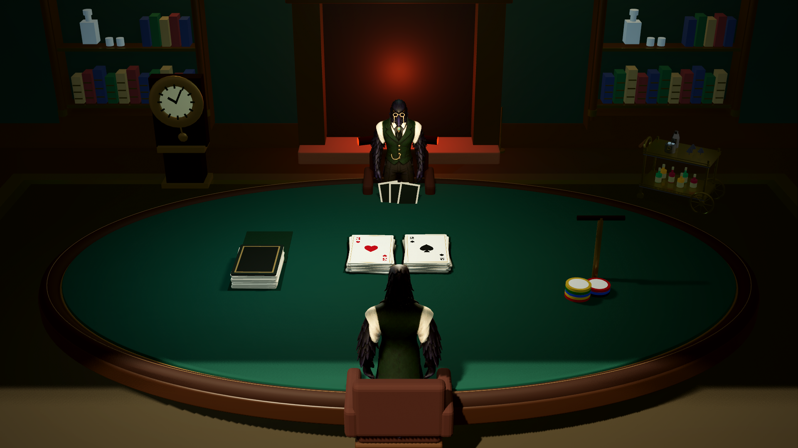

# Lareira do Classic Club — antes/depois

Base 87a7b98; Backup 18bdc3b. Blender MCP 9876; Godot 4.7.2 .NET, Forward+/Vulkan, RTX 3050. Materiais dos troncos, painel de fundo e bevel refinados; UV2 candidata adicionada ao cenário. Nenhuma luz adicional ou novo efeito de pós-processamento.

## Medições desta sessão

Composição fixa, 90 amostras por configuração. Mediana e P95 são intervalos observados entre quadros, não custo isolado de GPU. Processos externos não são controlados. Não comparar diretamente estes valores com os do Patch 27 nem afirmar ganho de desempenho por pequenas diferenças.

| Configuração | Antes mediana/P95 ms | Depois mediana/P95 ms | Draw calls antes → depois |
|---|---:|---:|---:|
| 1920-baixo-pov | 9.376 / 11.855 | 9.111 / 10.294 | 471 → 474 |
| 1920-baixo-mesa | 10.556 / 13.220 | 9.951 / 11.210 | 461 → 463 |
| 1920-ultra-pov | 18.024 / 21.314 | 19.591 / 22.937 | 841 → 850 |
| 1920-ultra-mesa | 19.977 / 21.947 | 20.504 / 23.876 | 461 → 463 |
| 3840-baixo-pov | 29.006 / 31.369 | 28.279 / 31.919 | 471 → 474 |
| 3840-baixo-mesa | 30.711 / 33.302 | 30.421 / 32.534 | 461 → 463 |
| 3840-ultra-pov | 57.608 / 62.037 | 58.037 / 62.100 | 471 → 474 |
| 3840-ultra-mesa | 61.847 / 67.042 | 58.796 / 64.446 | 461 → 463 |

## Validação

Exportação: seis malhas, 37 primitivas com UV2 em 0–1, sem esqueletos/animações na sala. Fonte: 30.692 vértices / 16.560 triângulos, acréscimo de 704 triângulos. UV2 não significa LightmapGI concluído: falta avaliar densidade/margens e realizar o bake no editor.

Regras PASS (531 verificações); interface PASS (27 capturas, 25 ações, nenhum erro de layout); regressão das quatro salas/assentos/baralho PASS. Os testes finais não reportaram exceções. Avisos de objetos/texturas retidos ao encerrar continuam presentes; não houve investigação de memória em partida longa.

Fontes editáveis, auditoria e hash do export em art/blender/patch30. [Plano e limitações](../PLANO_VISUAL30.md).

## Antes — mesa 1080p ultra

## Depois — mesa 1080p ultra

[POV antes](before/1920-ultra-pov.png) · [POV depois](after/1920-ultra-pov.png) · [4K antes](before/3840-ultra-pov.png) · [4K depois](after/3840-ultra-pov.png)
